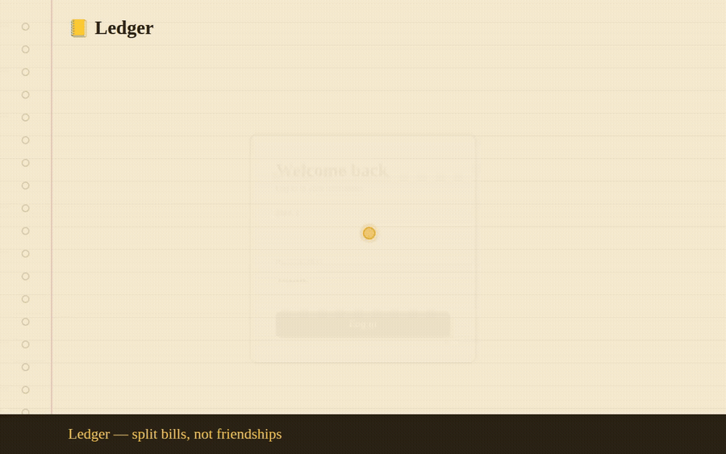

<div align="center">


<a href="https://github.com/Lakshpri/ledger-billsplit">
  
</a>

<br/>


<br/><br/>


</div>

<br/>

<p align="center">
  
</p>
<p align="center"><sub><i>Animated walkthrough mockup — login → create group → add expense → balances → settle up.</i></sub></p>

<p align="center">
  
</p>

---

### ✍️ What is this?

A full-stack, notebook-styled bill splitter. Create a group, log shared expenses in three different ways, and let a **debt-simplification algorithm** figure out the minimum number of payments needed to settle everyone up — instead of everyone paying everyone.

<br/>

<table align="center">
<tr>
<td width="33%" valign="top">

#### 👥 Groups
Create groups, invite members by email, see everyone's avatar at a glance.

</td>
<td width="33%" valign="top">

#### 🧾 Expenses
Split **equally**, by **exact amounts**, or by **percentage** — each with its own currency snapshot.

</td>
<td width="33%" valign="top">

#### ⚖️ Balances
A greedy algorithm collapses tangled IOUs into the *fewest possible payments*.

</td>
</tr>
</table>

<br/>

---

### 🧠 Under the hood
┌─────────────────────┐ JWT ┌──────────────────────┐ JPA ┌─────────────┐
│ Angular Frontend │ ─────────────────▶ │ Spring Boot Backend │ ─────────────────▶ │ PostgreSQL │
│ standalone + signals│ ◀───────────────── │ REST + BCrypt auth │ ◀───────────────── │ │
└─────────────────────┘ └──────────────────────┘ └─────────────┘


| Layer | Stack |
|---|---|
| **Frontend** | Angular (standalone components, signals) — no NgRx, no UI kit, just components + services |
| **Backend** | Spring Boot 3, Spring Security, JWT auth, BCrypt password hashing |
| **Database** | PostgreSQL via JPA/Hibernate — auto-migrated (`ddl-auto: update`) |
| **Auth** | Stateless JWT, 24h expiry |

<br/>

---

### 🚀 Quick start

```bash
# 1. Database
psql -U postgres -c "CREATE DATABASE billsplit;"

# 2. Backend  → http://localhost:8765
cd backend
mvn spring-boot:run

# 3. Frontend → http://localhost:4200 (in a second terminal)
cd frontend
npm install
npm start
```

Then open **http://localhost:4200**, create an account, spin up a group, invite a friend by email (they'll need an account too — or just make two yourself to try it out), and start adding expenses.

<br/>

---

### ⚙️ What's implemented

- 🔐 **Auth** — register/login with JWT, passwords hashed with BCrypt
- 👥 **Groups** — create, list, view, invite members by email
- 🧾 **Expenses** — three split modes (equal / exact / percentage), each with its own currency + exchange-rate snapshot
- ⚖️ **Balances** — live "who owes whom" per group, shown in the group's base currency
- 🧮 **Debt simplification** — a greedy algorithm reduces everyone's tangled IOUs to the minimum number of payments needed to settle up → [`BalanceService.java`](backend/src/main/java/com/notebook/splitter/service/BalanceService.java)
- 💵 **Settlements** — record a payment (currency + note optional), view full settlement history per group
- 🌍 **Multi-currency** — every expense/settlement stores its own currency + a snapshot exchange rate to the group's base currency, so historical amounts stay accurate even if today's rates change

<br/>

---

### 🔍 Where to look first

| Curious about... | Look here |
|---|---|
| The debt-simplification algorithm | [`backend/.../service/BalanceService.java`](backend/src/main/java/com/notebook/splitter/service/BalanceService.java) |
| Split calculation logic (equal/exact/%) | [`backend/.../service/ExpenseService.java`](backend/src/main/java/com/notebook/splitter/service/ExpenseService.java) |
| The notebook design system | [`frontend/src/styles.scss`](frontend/src/styles.scss) |
| The main group screen (tabs) | [`frontend/.../group-detail.component.ts`](frontend/src/app/features/groups/group-detail/group-detail.component.ts) |

<br/>

---

### 🌱 Beginner-friendly by design

- `spring.jpa.hibernate.ddl-auto: update` — no hand-run SQL migrations while learning; the backend builds its own tables
- Every backend class has a short comment explaining **why** it exists, not just what it does
- The frontend has no NgRx, no UI kit, no extra build plugins — just components, services, and one shared stylesheet
- Backend errors are plain English and shown directly in the UI (see the `.error-note` boxes)

<br/>

---

<div align="center">

**Backend docs →** [`backend/README.md`](backend/README.md) &nbsp;|&nbsp; **Frontend docs →** [`frontend/README.md`](frontend/README.md) &nbsp;|&nbsp; **Schema reference →** [`database/schema.sql`](database/schema.sql)

<br/>


</div>
